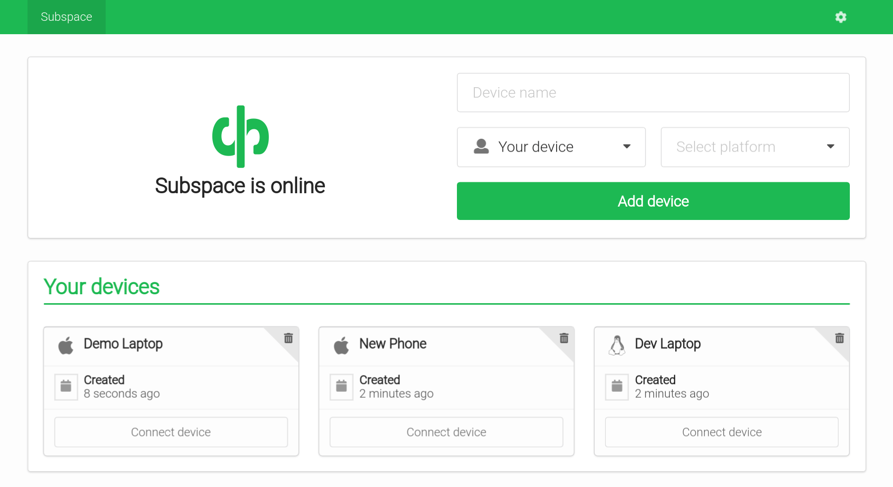

# Subspace - A simple WireGuard VPN server GUI




Additional screenshots: [1](screenshot1.png), [2](screenshot2.png), [3](screenshot3.png), [4](screenshot4.png).

## Features

* **WireGuard VPN Protocol**
  * The most modern and fastest VPN protocol.
* **Single Sign-On (SSO) with SAML**
  * Support for SAML providers like G Suite and Okta.
* **Add Devices**
  * Connect from Mac OS X, Windows, Linux, Android, or iOS.
* **Remove Devices**
  * Removes client key and disconnects client.
* **Auto-generated Configs**
  * Each client gets a unique downloadable config file.
  * Generates a QR code for easy importing on iOS and Android.

## Simwood Fork

This has been forked by [Simwood](https://simwood.com) as the [original project](https://github.com/subspacecloud/subspace) didn't appear to be maintained. There are a number of changes:

* Replaced CloudFlare DNS with [Quad9](https://www.quad9.net) to enhance privacy
* Disabled Let's Encrypt as the library was outdated and it didn't work. Ensure the web interface is not publicly reachable!
* Removed 10 user limit
* Rebuilt the Docker image (available on [Docker Hub](https://hub.docker.com/r/simwood/subspace))

## Quickstart (Ubuntu and Docker)

1. Get a Ubuntu 18.04 LTS (Bionic Beaver) virtual or dedicated host from your provider of choice. A minimum of 512MB memory recommended.

2. *Optional* - Set up an A record pointing to the public IP of the host. For example: `subspace.mydomain.com`.

3. Install and setup Docker, WireGuard and Subspace on the host:

**Make sure you run the following as root!**

```bash
bash <(curl -s https://raw.githubusercontent.com/kacalayar/subs/master/ubuntu_install.sh)
```

Or run the commands manually:

```bash
# Add repository and install WireGuard
add-apt-repository -y ppa:wireguard/wireguard
apt-get update
apt-get install -y wireguard

# Set DNS
echo nameserver 9.9.9.9 > /etc/resolv.conf

# Load modules
modprobe wireguard
modprobe iptable_nat
modprobe ip6table_nat

echo "wireguard" >> /etc/modules
echo "iptable_nat" >> /etc/modules
echo "ip6table_nat" >> /etc/modules

# Enable IP forwarding
sysctl -w net.ipv4.ip_forward=1
sysctl -w net.ipv6.conf.all.forwarding=1

sed -i 's/#net.ipv4.ip_forward=1/net.ipv4.ip_forward=1/g' /etc/sysctl.conf
sed -i 's/#net.ipv6.conf.all.forwarding=1/net.ipv6.conf.all.forwarding=1/g' /etc/sysctl.conf

# Disable resolved
systemctl disable systemd-resolved
systemctl stop systemd-resolved
```

4. Install Docker Engine:

The commands below should be all you need to install Docker Engine (CE) on a Ubuntu 18.04.3 (LTS) x64 host. But use the official [Docker Documentation](https://docs.docker.com/install/linux/docker-ce/ubuntu/) if you run into any issues.

```bash
# Install packages to allow apt to use a repository over HTTPS
apt-get install -y \
    apt-transport-https \
    ca-certificates \
    curl \
    gnupg-agent \
    software-properties-common

# Add Docker’s official GPG key
curl -fsSL https://download.docker.com/linux/ubuntu/gpg | sudo apt-key add -

# Set up the stable repository
add-apt-repository \
   "deb [arch=amd64] https://download.docker.com/linux/ubuntu \
   $(lsb_release -cs) \
   stable"

# Update apt and install the latest version of Docker Engine (CE) and containerd
apt-get update

apt-get install -y \
    docker-ce \
    docker-ce-cli \
    containerd.io
```

5. Run Subspace container:

Replace `subspace.mydomain.com` with the domain from step 2 or public IP.

You can also replace `simwood/subspace:latest` with a specific [tagged version](https://hub.docker.com/r/simwood/subspace/tags), for example: `simwood/subspace:1.0`, but `latest` will be the most recent.

```bash
docker run -d \
    --name subspace \
    --restart always \
    --network host \
    --cap-add NET_ADMIN \
    --volume /usr/bin/wg:/usr/bin/wg \
    --volume /data:/data \
    --env SUBSPACE_HTTP_HOST=subspace.mydomain.com \
    --env SUBSPACE_HTTP_INSECURE=true \
    --env SUBSPACE_LETSENCRYPT=false \
    simwood/subspace:latest
```

After a few moments you should be able to reach the Subspace interface at `http://subspace.example.com`. You can check the logs from the container using: `docker logs subspace`.

### Updating the container

Pull the latest Subspace image:

```
docker pull simwood/subspace:latest
```

Or a specific [tagged version](https://hub.docker.com/r/simwood/subspace/tags):

```
docker pull simwood/subspace:1.0
```

Remove the old container:

```
docker rm -f subspace
```

Then finally create a new container again using the same `docker run -d` command from above that you ran the first time with any values that you might have changed (step 5).

## Static binary

You can also run the [static binary](https://github.com/simwood/subspace/blob/master/subspace-linux-amd64) outside of Docker directly on a AMD64 Linux host:

```bash
./subspace-linux-amd64
```

## Building

### Go Binary

```bash
docker build -t subspace-build -f Dockerfile.build .
docker run -d --name subspace-build subspace-build tail -f /dev/null
docker cp subspace-build:/usr/bin/subspace-linux-amd64 .
docker rm -f subspace-build
```

### Docker image

```bash
docker build -t subspace .
```

## Support

Please [create an issue](https://github.com/simwood/subspace/issues/new) if you encounter any issues or bugs with this project (or create a [pull request](https://github.com/simwood/subspace/pulls)). The Simwood support desk are unable to assist with issues related to this project or Subspace / WireGuard in general.
